# 

# Typescript Notes

It is development tool not a programming lang for JS.
And All it does is static checking.. that its

1.Static checking and difference between TS & JS

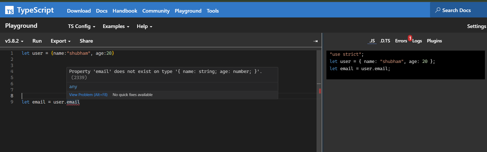

_here left side TS code did not allow me to write code when there was error but at right there this JS does not giv any error and just allow to write further._

**Our app still runs on JS because Ts actaully get coverted into Js**

**This is static checking..**

### Another Fact that now it allow to write the kind of errored code.

_below code.._

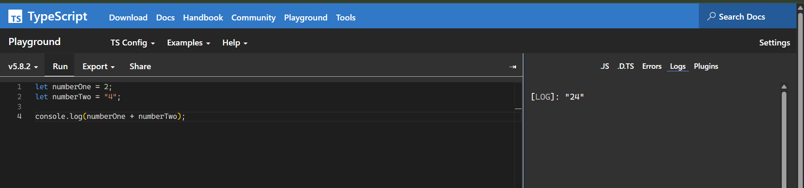

## Installation of Typescript.

## Now, there are two ways of typescript installation setup.

### 1. Basic installation setup

**In this installation process, we actually install Ts globally in system only.**
This setup is actually to learn and know Typescript. eg. _how it works and what are basics concepts of it._

### 2. Project based installation setup

**In this installation process, we actually setup and config the typescript setup for particular project**
This setup is actually for project based.eg. _may be we are going to work with react or angular, we can config it with our preference._

## Basic installation setup

### This is for learning and going through basic concepts of Ts.

1. Open terminal or git bash.
2. Run the following command.

```
npm install -g typescript
```

This installs the TypeScript Compiler tsc globally. You can use npx or similar tools if you’d prefer to run tsc from a local node_modules package instead.

3. Check the typescript version

```
tsc -v
```

## Let's get started..

1. Create a folder.
2. Create a file in it. `intro.ts`
3. Write some code.
4. open the terminal and run cmd `tsc intro.ts`
5. We will get `intro.js` file which is actually return by `intro.ts` file execution.

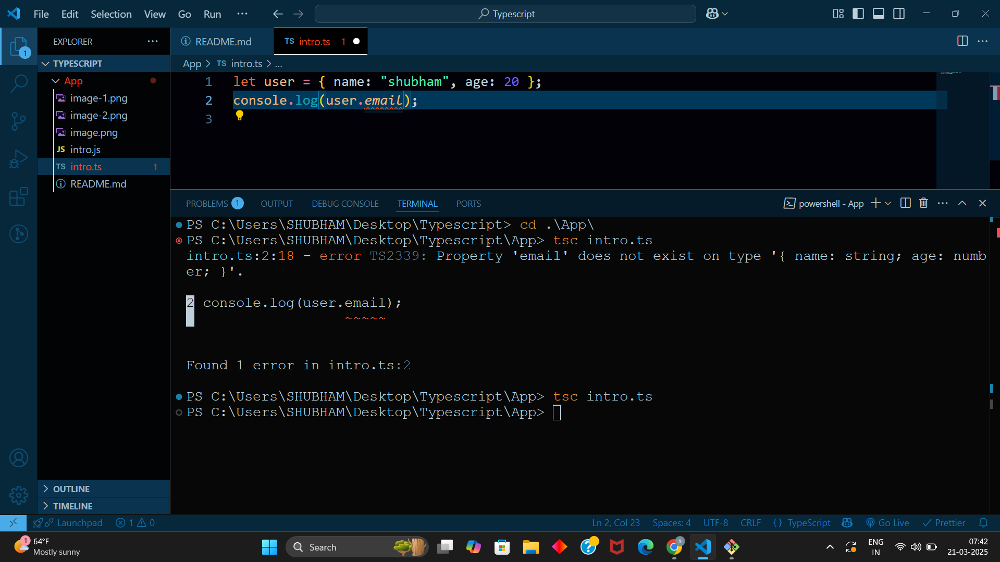

## Read the documentation.

### Read only basics like how many types are there..

## Main concepts in Ts.

### 1. Type inference

Typescript is smart enough to detect which data type you want to assign to a variable.
**So instead of always mentioning the type while assigning the value, you can actually write it in Js manner**

_Below code..._

```javascript
let userID: number = 5363;

// Dont need this,

let userID = 5363;
// here, Ts will detect automatically and prevent from assigning different type.
```

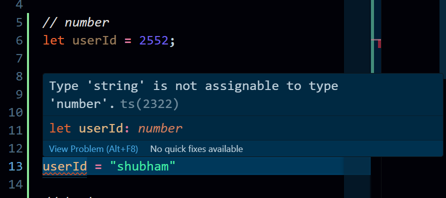

**Here below, where should we explicitly declare its type**
_here comes `any` keyword.._

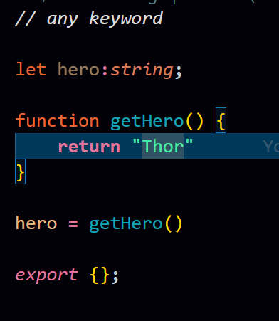

here, we should explicitly assign the type because we dont know what it going to be n future.
_if we not mention its type explicitly, it will take all types to anywhere.._

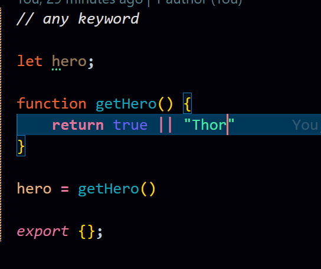

### 2. Any keyword

`Any` keyword is actaully used when we dont want **type checking** for that part of code.
\*We can say, we actually off the type checking of Ts for that part of code **which sometimes we need to..\***

### 3. Functions in Ts

**Functions in Typescript should be in Type checking mode always.**
Otherwise these could happen..

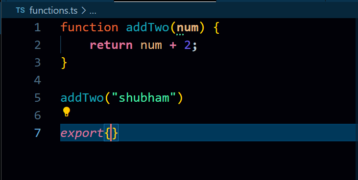

_The correct code is below.._

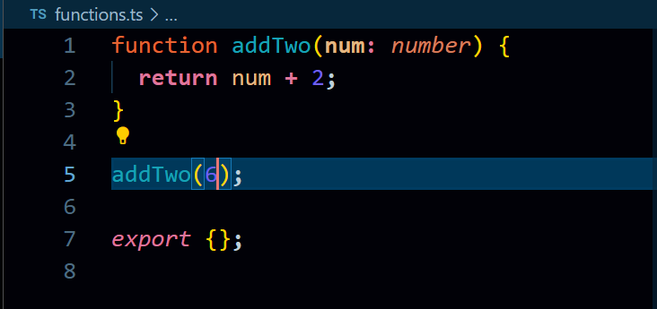

**Another IMP concepts while writing functions in Ts**
We know about basic that it should take argument and check its type but what about type it going to return.

_See the incorrect code below.._

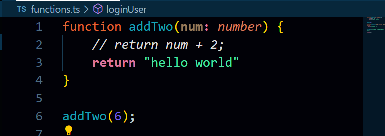
the above function should be return the number but it's returning string, which is not good.

_mentioning type after argument brackets_
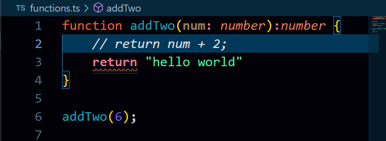

How to avoid these..
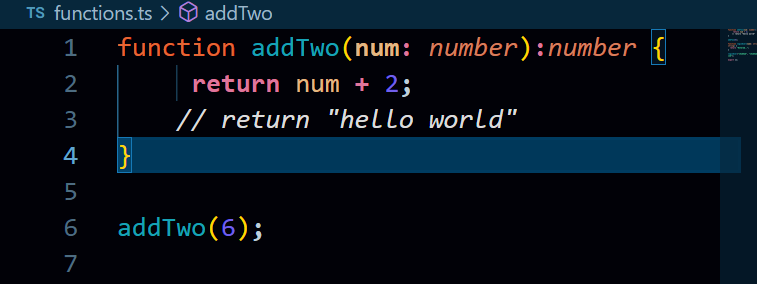

### These could be happen in Ts

**Sometimes we actually need to return multiple types.**
_see the two code snippet below._
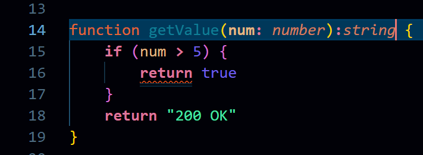

<hr>

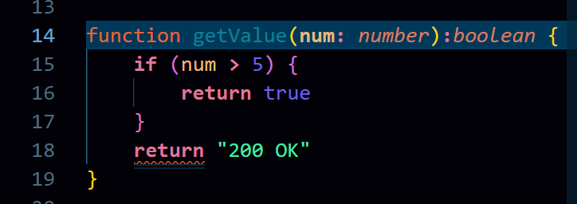

### `never` and `void` keyword

1. TypeScript void Function

Void type does not return anything. Just do the process if there.
**So, its return type is `void`.**

```typescript
function greet(name: string): void {
  console.log(`Hello, ${name}!`);
}

greet("GeeksforGeeks");
```

Output -

```
Hello, GeeksforGeeks!
```

2. never in Typecript
   Used when function never returns.

**usually for errors and infinite loops.**

```typescript
function throwError(): never {
  throw new Error("Something went wrong!");
}
```

✅ throwError function never returns anything because it always throws an error.

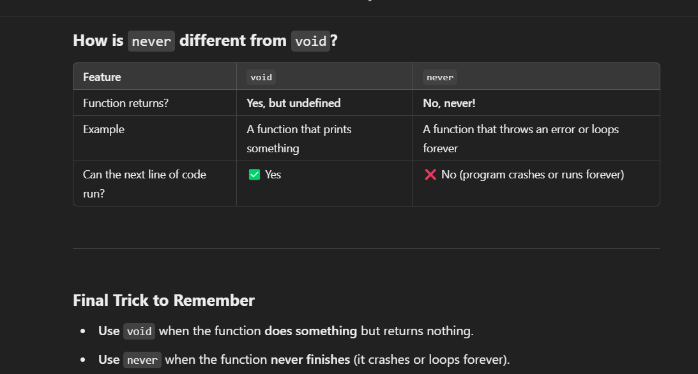
