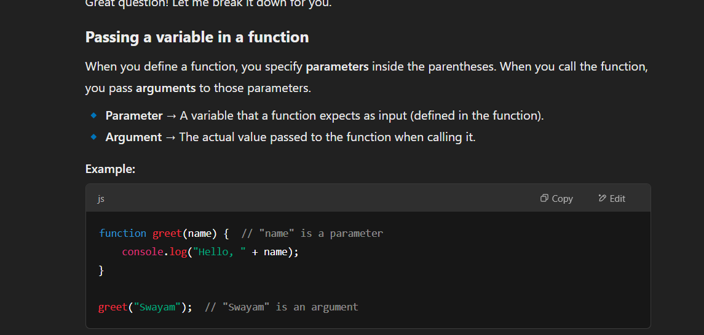
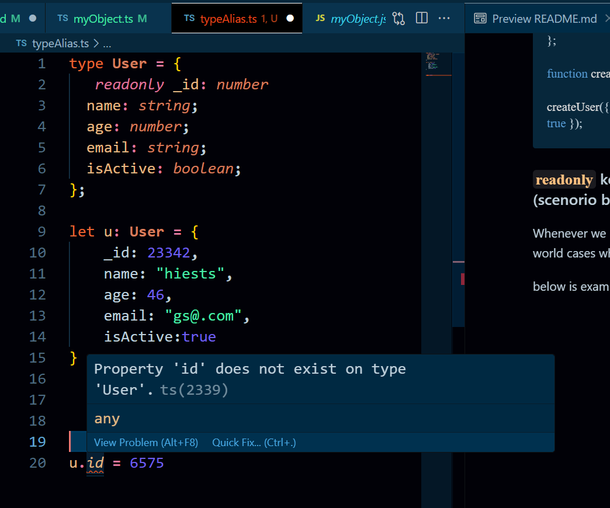
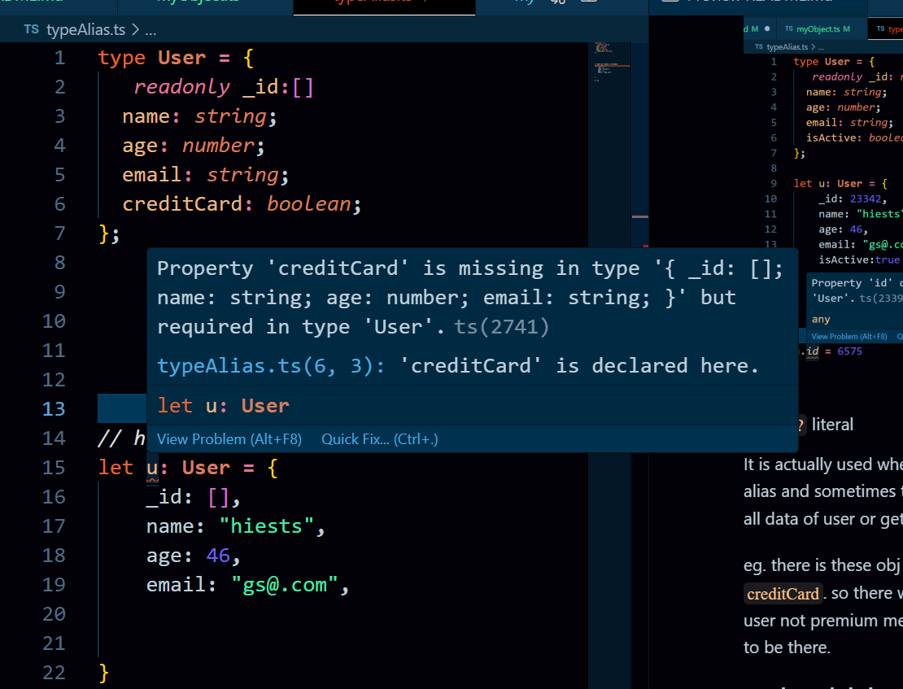
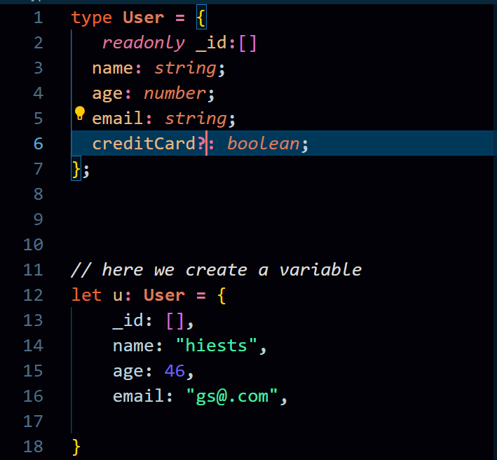
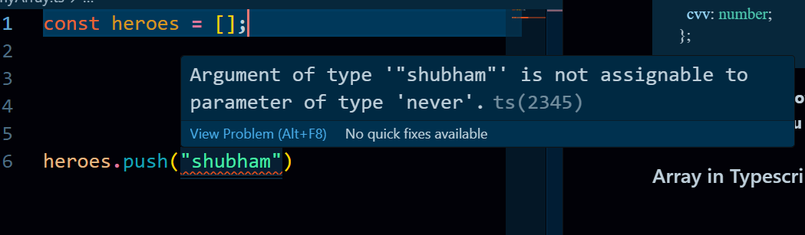
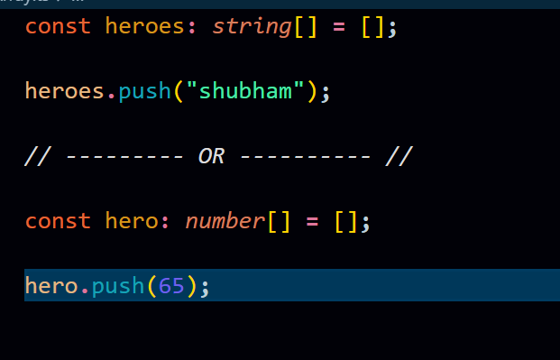
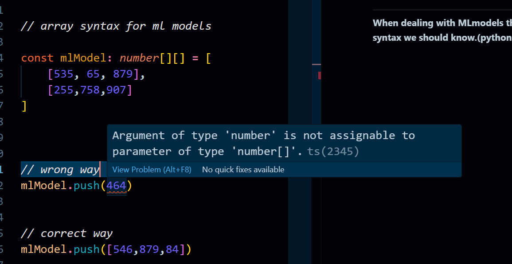
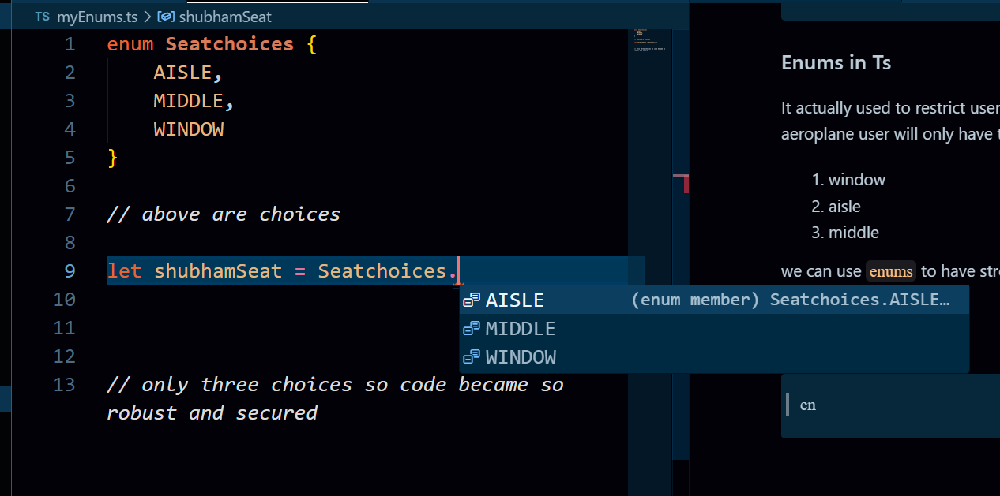
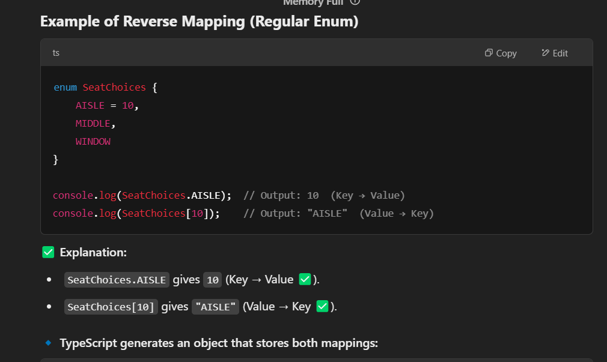
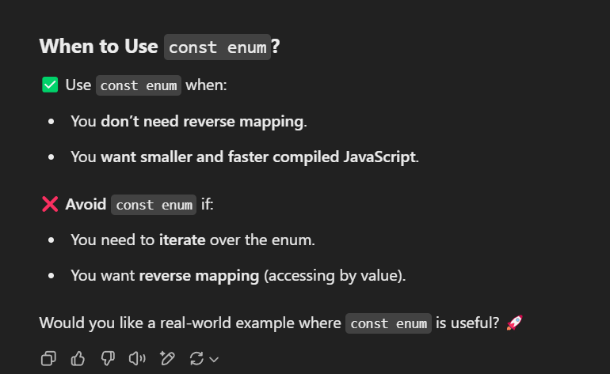

# 

# Typescript Notes

It is development tool not a programming lang for JS.
And All it does is static checking.. that its

1.Static checking and difference between TS & JS


_here left side TS code did not allow me to write code when there was error but at right there this JS does not giv any error and just allow to write further._

**Our app still runs on JS because Ts actaully get coverted into Js**

**This is static checking..**

### Another Fact that now it allow to write the kind of errored code.

_below code.._


## Installation of Typescript.

## Now, there are two ways of typescript installation setup.

### 1. Basic installation setup

**In this installation process, we actually install Ts globally in system only.**
This setup is actually to learn and know Typescript. eg. _how it works and what are basics concepts of it._

### 2. Project based installation setup

**In this installation process, we actually setup and config the typescript setup for particular project**
This setup is actually for project based.eg. _may be we are going to work with react or angular, we can config it with our preference._

## Basic installation setup

### This is for learning and going through basic concepts of Ts.

1. Open terminal or git bash.
2. Run the following command.

```
npm install -g typescript
```

This installs the TypeScript Compiler tsc globally. You can use npx or similar tools if you’d prefer to run tsc from a local node_modules package instead.

3. Check the typescript version

```
tsc -v
```

## Let's get started..

1. Create a folder.
2. Create a file in it. `intro.ts`
3. Write some code.
4. open the terminal and run cmd `tsc intro.ts`
5. We will get `intro.js` file which is actually return by `intro.ts` file execution.


## Read the documentation.

### Read only basics like how many types are there..

## Main concepts in Ts.

### 1. Type inference

Typescript is smart enough to detect which data type you want to assign to a variable.
**So instead of always mentioning the type while assigning the value, you can actually write it in Js manner**

_Below code..._

```javascript
let userID: number = 5363;

// Dont need this,

let userID = 5363;
// here, Ts will detect automatically and prevent from assigning different type.
```


**Here below, where should we explicitly declare its type**
_here comes `any` keyword.._


here, we should explicitly assign the type because we dont know what it going to be n future.
_if we not mention its type explicitly, it will take all types to anywhere.._


### 2. Any keyword

`Any` keyword is actaully used when we dont want **type checking** for that part of code.
\*We can say, we actually off the type checking of Ts for that part of code **which sometimes we need to..\***

### 3. Functions in Ts

**Functions in Typescript should be in Type checking mode always.**
Otherwise these could happen..
always mention type returning value.


_The correct code is below.._


**Another IMP concepts while writing functions in Ts**
We know about basic that it should take argument and check its type but what about type it going to return.

_See the incorrect code below.._


the above function should be return the number but it's returning string, which is not good.

_mentioning type after argument brackets_


How to avoid these..


### These could be happen in Ts

**Sometimes we actually need to return multiple types.**
_see the two code snippet below._


<hr>


### `never` and `void` keyword

1. TypeScript void Function

Void type does not return anything. Just do the process if there.
**So, its return type is `void`.**

```typescript
function greet(name: string): void {
  console.log(`Hello, ${name}!`);
}

greet("GeeksforGeeks");
```

Output -

```
Hello, GeeksforGeeks!
```

2. never in Typecript
   Used when function never returns.

**usually for errors and infinite loops.**

```typescript
function throwError(): never {
  throw new Error("Something went wrong!");
}
```

✅ throwError function never returns anything because it always throws an error.


### IMP NOTES (Parameter and Argument)



### Type alias

**Type Alias is used to create a custom name for a type. This makes your code more readable and reusable.**
It is actually used to improve code readability and for avoiding writing complex type definations multiple times.

We use the `type` keyword to create a Type Alias.

```typescript
type MyType = string; // Now, 'MyType' is an alias for 'string'

let username: MyType = "Shubham";
```

**Another Usecase**

```typescript
type User = {
  name: string;
  age: number;
  email: string;
  isActive: boolean;
};

function createUser(user: User) {}

createUser({ name: "s", age: 67, email: "mail", isActive: true });
```

### `readonly` keyword, `?` & use case scenario (scenorio based).

1. `readonly` keyword

Whenever we have type alias, which we used in most real world cases where there would be unique _ID_.

below is example,

**`readonly` actually dont allow us reassign the value of that particular property.**



2. `?` literal

It is actually used when we define the type in while type alias and sometimes there is case when we did not need all data of user or get data while keeping some optional.

eg. there is these obj where properties are `name`, `email` & `creditCard`. so there will chance that our customer is free user not premium meaning credit card data is not going to be there.

**see the code below, you will get it.**



**But as soon as i put `?` after `creditCard`** , it will not show error because sometimes there creditCard detail wont be there & sometimes it will be there and can happen while passing this obj to a function for further process.



3. We can actually combine many type into one type.

```typescript
type cardNumber = {
  cardNumber: number;
};

type cardDate = {
  cardDate: number;
};

// merge two type into one
type cardDetails = cardDate &
  cardNumber & {
    cvv: number;
  };
```

**In real when some other have already have type and working well, if you want to add new, so you do this.**

### Array in Typescript



This is not way of creating array in Ts.

**This is correct way**



**Or another way is below**

```typescript
const myHeroes: Array<number> = [];
```

**Another real world use case**

_Below code is there when we have to store **objects** in an Array._
(type alias based)

```typescript
type User = {
  name: string;
  isActive: boolean;
};

const allUsers: User[] = [];

// now we can append the objects in an array

allUsers.push({ name: "shubham", isActive: true });
```

<hr>

**When dealing with MLmodels there will be different syntax we should know.(python based).**

_actually nested array, we can say???_



### Union type in Ts.

It is actually combining data types and use it.

_have a look at myUnion.ts file._

```typescript
let score: number | string = 674;

score = "shubham"; // No Error :)

// lets say we're building an application where user can be user or admin.

type User = {
  name: string;
  id: number;
};

type Admin = {
  username: string;
  adminId: number;
};

// inially user was normal user
let shubham: User | Admin = {
  name: "Tom",
  id: 101,
};

// Now, it can be change into a admin

shubham = {
  username: "Shubh",
  adminId: 67,
};

export {};
```

<hr>

**Array with unions where fun begins..**

```typescript
// Array with unions

const data1: number[] = [1, 2, 4]; // cannot add other types except number.

const data2: string[] = ["1", "3", "57"]; // cannot add other types except string

const data3: string[] | number[] = [5363, 774, 838]; // it will either number array or string array.(not both at same time)

const data4: (string | number | boolean)[] = [1, 2, 3, "shubham", true]; // this is possible only using this syntax.
```

<hr>

If we building aeroplane app, seat allotement.

**Good for strict and secured apps.**

```typescript
let seatAllotement: "aisle" | "window" | "middle";

seatAllotement = "aisle"; // no error
seatAllotement = "middle"; // no error
seatAllotement = "window"; // no error
seatAllotement = "crew side"; // Throw error...
```

### Tuples in Ts.

It is simple as array, here what matters is order. typescript actually put strict order using **tuple**.

```typescript
let user: (number | string)[] = [1, 2, "s"]; // here order dont matter at all..

// but when we say like

let apiData: [string, number, boolean];
apiData = ["", 657, true];
// all correct

apiData = [757, "sh", true]; // throws error.
```

### Enums in Ts

It actually used to restrict user's choices. lets say, in aeroplane user will only have three choices to book.

1. window
2. aisle
3. middle

we can use `enums` to have strong and restrictive choice.

_see the below code_



Eventually we can more choices as filght would be international :)

here, there were number assign them by default. starting from 0 when you hover on them.

we can customize it.

```typescript
enum Seatchoices {
  AISLE = 10,
  MIDDLE, // this will 11
  WINDOW, // this will 12
}
```

<hr>



**IMP**
Just ask AI, when and why const is used before `enum` keyword.



#### When we use const enum.

```typescript
const enum SeatChoices {
  AISLE = 10,
  MIDDLE,
  WINDOW,
}

console.log(SeatChoices.AISLE); // ✅ Still works (Output: 10)
console.log(SeatChoices[10]); // ❌ ERROR! (Reverse mapping not available)
```
